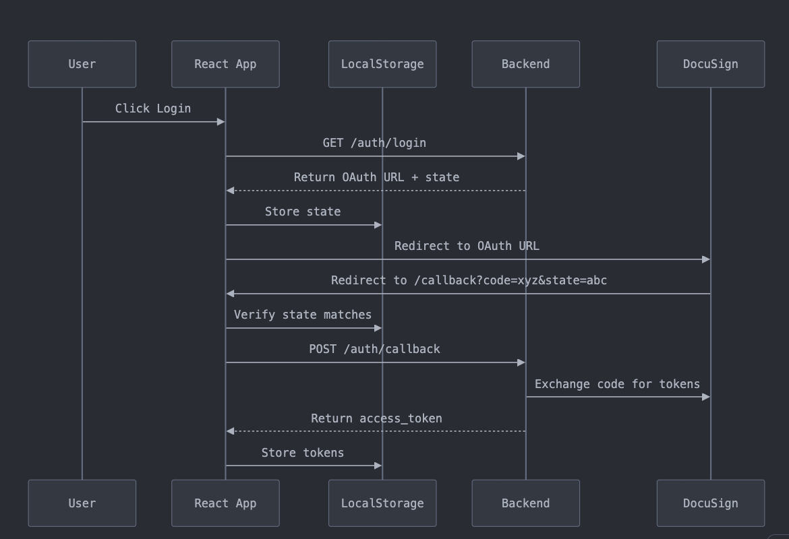

# ⚠️ Important Git History Notice

Due to previous omission of API credentials in the git repository and considering this will become public, **the git history cannot be retained**. This is a critical security measure to protect sensitive information.

# DocuSign Integration

## Authentication Implementation

  

We implement DocuSign authentication using the **Confidential Authorization Code Grant** flow, which provides:

- Enhanced security for server-side applications
- Ability to refresh access tokens
- Compliance with OAuth 2.0 standards

## DocuSign APIs in Use

### Authorization API

Handles all authentication flows and token management.

### Envelope API

Manages document signing workflows including:

- Creating and sending envelopes
- Managing envelope status
- Handling recipients
- Document management within envelopes

### Navigator API

Currently used for agreement listing functionality. Note that this API has limited availability:

- Only 2 routes currently accessible
- Core functionality still in development
- Limited production readiness

# External API Integrations

The following third-party APIs are integrated:

## Social Media & Content

- X (Twitter) API
- YouTube API

## Blockchain & NFT

- Bitscrunch API
- Lens Protocol API

Note: Each external API integration should maintain its own credential management and error handling strategies.

---

# Navigator API Implementation Concerns

## Current Status

- Only 2 routes available
- Limited API readiness
- Non-critical functionality

## Implementation Challenges

### Premature Integration Attempt

The suggestion to implement Navigator API features was questionable given its early development stage. This created unnecessary complexity in the development process.

### AI Integration Difficulties

Initial attempt to build an AI-agent:

- Halted due to Navigator API limitations
- Struggled with "AI-ify Your World" theme implementation
- So foucsed on "Making the Impossible...Possible" theme instead
- Incomplete understanding of integration requirements

## Mitigation Strategy

### Current Focus

Shifted priority to core app implementation:

- Postponing AI-agent development
- Focusing on essential features
- Building stable foundation first

### Future Considerations

Will revisit Navigator API integration when:

- More routes become available
- API reaches production readiness
- Clear integration path established
